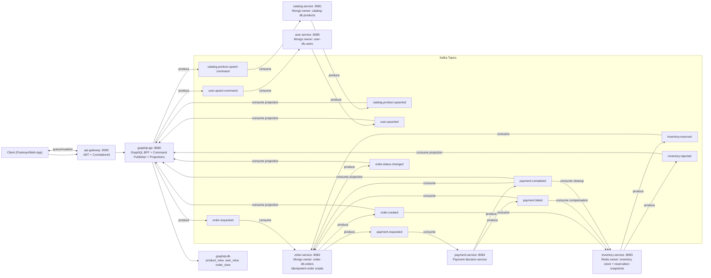
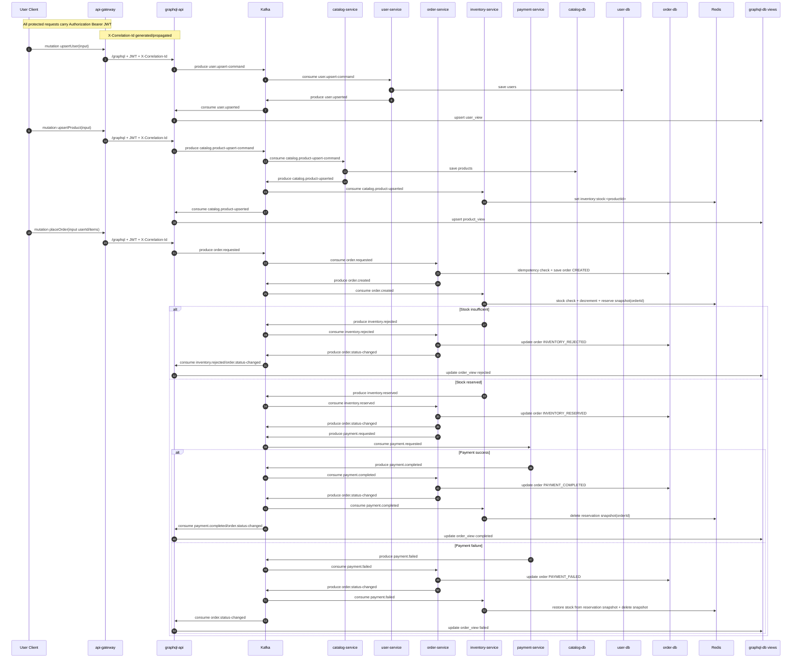

# Event-Driven E-Commerce Microservices

This repository has been rebuilt into an event-driven e-commerce platform using:
- Apache Kafka (event backbone)
- MongoDB (service data + GraphQL read models)
- Redis (inventory stock state)
- GraphQL (gateway/BFF)
- ELK (centralized log aggregation and search)
- Spring Boot (microservices)

## Production-Grade Hardening Added

- End-to-end correlation tracing:
  - `X-Correlation-Id` is accepted/generated at gateway and propagated through GraphQL and Kafka headers.
  - Consumer services load correlation into MDC so all logs are traceable by one correlation id.
- Idempotent order creation:
  - `order-service` ignores duplicate `order.requested` events for an already existing `orderId`.
- Payment compensation:
  - `inventory-service` stores reservation snapshots per order.
  - On `payment.failed`, stock is automatically restored.
  - On `payment.completed`, reservation snapshot is cleared.

## Services

- `graphql-api` (port `8080`): GraphQL entrypoint for queries/mutations. Publishes commands and maintains read projections.
- `api-gateway` (port `8090`): Edge gateway for GraphQL with JWT guard and correlation-id tracing.
- `catalog-service` (port `8081`): Handles product upsert commands and emits product events.
- `order-service` (port `8082`): Handles order requests and saga state transitions.
- `inventory-service` (port `8083`): Maintains stock in Redis, reserves/rejects inventory.
- `payment-service` (port `8084`): Processes payment requests and emits payment outcomes.
- `user-service` (port `8085`): Handles user upsert commands and emits user events.
- `common-events`: Shared Kafka contracts.

## Event Flow (Saga)

1. `upsertProduct` mutation -> `catalog.product-upsert-command`
2. `catalog-service` persists product -> emits `catalog.product-upserted`
3. `placeOrder` mutation -> `order.requested`
4. `order-service` creates order -> emits `order.created`
5. `inventory-service` checks Redis stock:
   - success -> emits `inventory.reserved`
   - failure -> emits `inventory.rejected`
6. On `inventory.reserved`, `order-service` emits `payment.requested`
7. `payment-service` emits:
   - `payment.completed` or
   - `payment.failed`
8. `order-service` updates final status and emits `order.status-changed`
9. `graphql-api` consumes events and updates MongoDB projections for queries.

## Detailed Architecture and Topic-Level Flow

### High-Level Data/Control Flow



### Detailed Sequence (Mutation to Final State)



### Service Responsibility and Topic Matrix

| Service | Owns Data | Consumes Topics | Produces Topics | Core Work |
|---|---|---|---|---|
| `api-gateway` | none | HTTP | HTTP (forward) | JWT validation, `X-Correlation-Id` generation/propagation, routing to GraphQL |
| `graphql-api` | `graphql-db.product_view`, `graphql-db.user_view`, `graphql-db.order_view` | `catalog.product-upserted`, `user.upserted`, `order.created`, `inventory.rejected`, `payment.completed`, `order.status-changed` | `catalog.product-upsert-command`, `user.upsert-command`, `order.requested` | BFF layer, command publishing, read-model projection updates |
| `catalog-service` | `catalog-db.products` | `catalog.product-upsert-command` | `catalog.product-upserted` | Product upsert write model |
| `user-service` | `user-db.users` | `user.upsert-command` | `user.upserted` | User upsert write model |
| `order-service` | `order-db.orders` | `order.requested`, `inventory.reserved`, `inventory.rejected`, `payment.completed`, `payment.failed` | `order.created`, `payment.requested`, `order.status-changed` | Order lifecycle, idempotency guard, saga transitions |
| `inventory-service` | Redis keys `inventory:stock:*`, `inventory:reservation:*` | `catalog.product-upserted`, `order.created`, `payment.completed`, `payment.failed` | `inventory.reserved`, `inventory.rejected` | Stock reservation, compensation restore on payment failure |
| `payment-service` | none (event-driven decisioning) | `payment.requested` | `payment.completed`, `payment.failed` | Payment outcome simulation |

### Traceability Guarantees

- HTTP request path: `Client -> api-gateway -> graphql-api` carries `X-Correlation-Id`.
- Kafka path: producers attach `X-Correlation-Id` in Kafka headers.
- Consumers extract header and load into MDC before processing.
- Logs include `correlationId`, topic, partition, offset, timestamp, key, payload.
- Kibana can trace one request across all services using:
  - `correlationId : "<value>"`

## Run Infra

```bash
docker compose up -d
```

Infra endpoints:
- Kafka: `localhost:9092`
- MongoDB: `localhost:27017`
- Redis: `localhost:6379`
- Elasticsearch: `http://localhost:9200`
- Logstash TCP input: `localhost:5044`
- Kibana: `http://localhost:5601`

## Build

```bash
./mvnw clean package -DskipTests
```

## Run Services

Start each service in separate terminals:

```bash
./mvnw -f api-gateway/pom.xml spring-boot:run
./mvnw -f graphql-api/pom.xml spring-boot:run
./mvnw -f catalog-service/pom.xml spring-boot:run
./mvnw -f order-service/pom.xml spring-boot:run
./mvnw -f inventory-service/pom.xml spring-boot:run
./mvnw -f payment-service/pom.xml spring-boot:run
./mvnw -f user-service/pom.xml spring-boot:run
```

## GraphQL Endpoint

- Direct URL: `http://localhost:8080/graphql`
- Through Gateway: `http://localhost:8090/graphql`
- GraphiQL direct: `http://localhost:8080/graphiql`
- GraphiQL through gateway: `http://localhost:8090/graphiql`

## API Gateway Notes

- Gateway runs on `8090` and routes `/graphql` and `/graphiql/**` to `graphql-api`.
- JWT validation is enabled by default for non-public paths (`security.jwt.enabled=true`).
- Public paths: `/actuator/health`, `/actuator/info`, `/auth/token`, `/graphiql`, `/graphiql/**`.
- Protected call example:
  - Add header: `Authorization: Bearer <jwt-token>`
- Correlation header:
  - Gateway injects `X-Correlation-Id` (or propagates existing one) for request tracing.

### Generate JWT for local testing

Request:

```bash
curl -X POST http://localhost:8090/auth/token \
  -H "Content-Type: application/json" \
  -d '{
    "userId": "user-1",
    "name": "Aditya",
    "email": "aditya@example.com",
    "ttlSeconds": 3600
  }'
```

Then call GraphQL through gateway:

```bash
curl -X POST http://localhost:8090/graphql \
  -H "Content-Type: application/json" \
  -H "Authorization: Bearer <token-from-auth-response>" \
  -d '{"query":"query { users { id name email } }"}'
```

## Sample Mutations / Queries

```graphql
mutation {
  upsertProduct(input: {
    name: "Noise Cancelling Headphones"
    description: "Wireless over-ear"
    price: 199.99
    stock: 15
  })
}
```

```graphql
mutation {
  placeOrder(input: {
    userId: "user-1"
    items: [{ productId: "<PRODUCT_ID>", quantity: 1, unitPrice: 199.99 }]
  })
}
```

```graphql
query {
  orders(userId: "user-1") {
    id
    status
    reason
    totalAmount
  }
}
```

```graphql
mutation {
  upsertUser(input: {
    name: "Aditya"
    email: "aditya@example.com"
  })
}
```

```graphql
query {
  users {
    id
    name
    email
  }
}
```

## Kibana Log Verification

Each service now writes structured JSON logs to Logstash over TCP (`localhost:5044`) and those logs are indexed in Elasticsearch.

1. Open Kibana at `http://localhost:5601`
2. Go to **Stack Management** -> **Data Views**
3. Create data view with pattern: `ecommerce-logs-*`
4. In **Discover**, filter logs with queries like:
   - `service : "order-service"`
   - `message : "Kafka produced"`
   - `message : "Kafka consumed"`
   - `message : "order.created"`
   - `correlationId : "<X-Correlation-Id value>"`

Kafka metadata (`topic`, `partition`, `offset`, `key`, `payload`) is included inside log messages emitted by producers/consumers.
